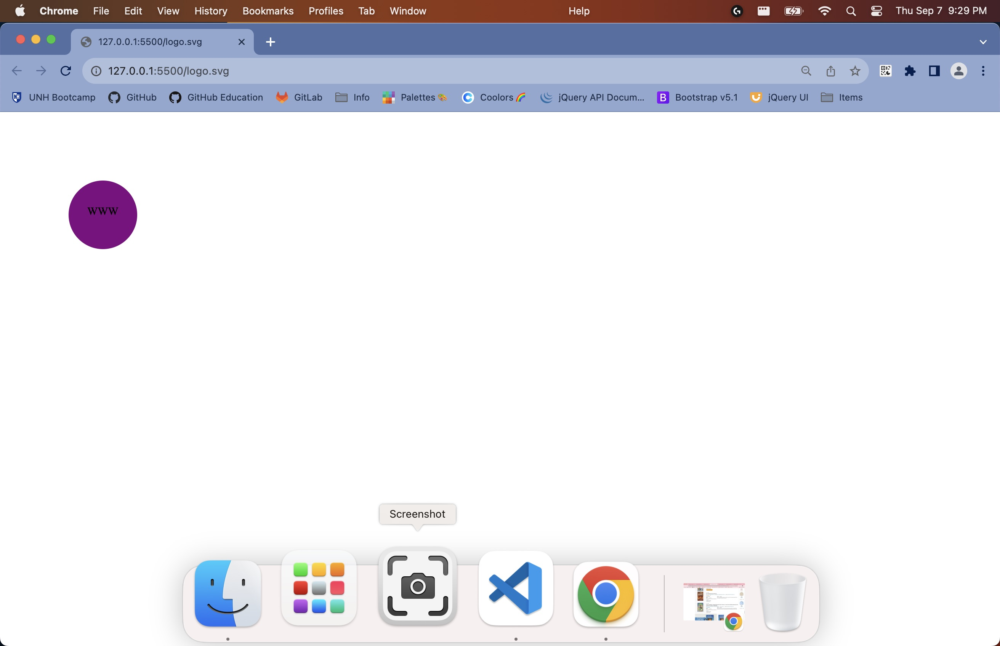
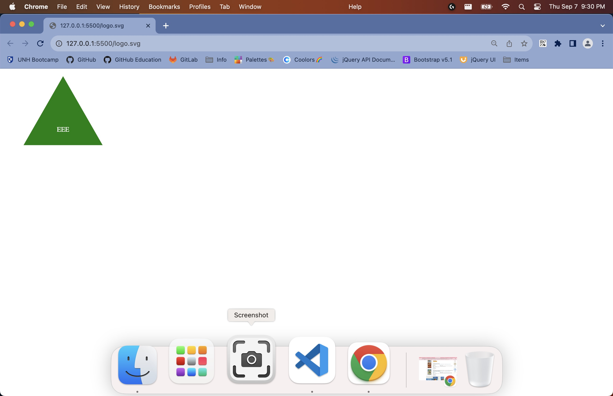
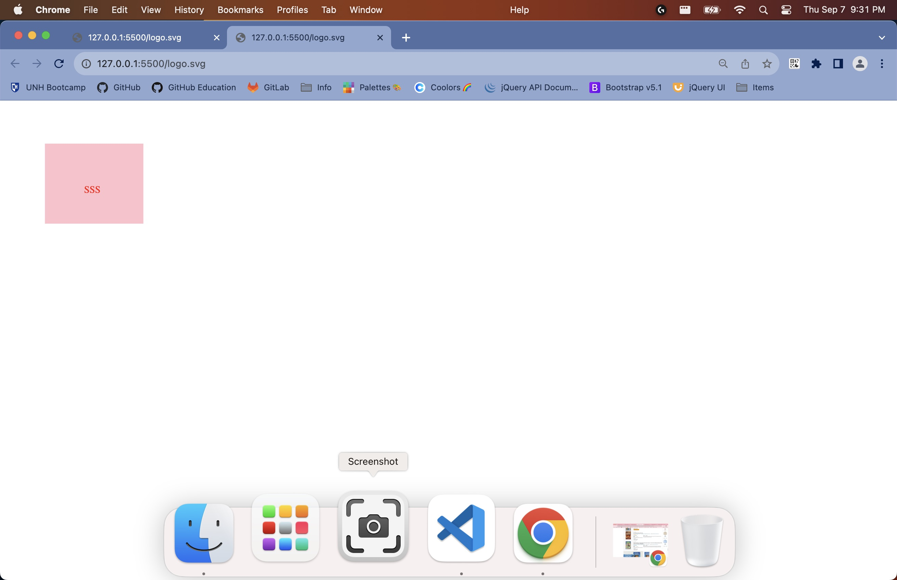

# Danielle-SVG-Logo-Maker

## Description
The purpose of this application is to create a quik and simple logo using Node JS. The application runs via CLI, collecting user input data through inquirer, once user input data is received a logo is created as an SVG file in which they can open and view.

Below in the Usage section is a walkthrough demonstrating how to utilize this application

## Installation
You will need Node.js: v18.17.1
npm: v9.6.7
inquirer: v8.2.6
I recommend installing the Live Server extension, available through Visual Studio Code
Svg Preview extension (Also available through Visual Studio Code) is useful, but not required 
Chrome, Edge, and Safari browsers all open the SVG file

## Usage
Below is a video demonstrating how to use the SVG Logo Maker. However once this repo is cloned and you have NPM (Node Package Manager installed), you would go to your terminal and run "node index.js" from there, you would get prompted to input needed information, and then you should be able to open your SVG logo in your web console.

[Where to watch a video example](https://drive.google.com/file/d/1YTkrF0LizTuYjq_Px_zRmje3ddczhApS/view?usp=drive_link)

## License
MIT License

Copyright (c) [2023] [Danielle-SVG-Logo-Maker]

Permission is hereby granted, free of charge, to any person obtaining a copy
of this software and associated documentation files (the "Software"), to deal
in the Software without restriction, including without limitation the rights
to use, copy, modify, merge, publish, distribute, sublicense, and/or sell
copies of the Software, and to permit persons to whom the Software is
furnished to do so, subject to the following conditions:

The above copyright notice and this permission notice shall be included in all
copies or substantial portions of the Software.

THE SOFTWARE IS PROVIDED "AS IS", WITHOUT WARRANTY OF ANY KIND, EXPRESS OR
IMPLIED, INCLUDING BUT NOT LIMITED TO THE WARRANTIES OF MERCHANTABILITY,
FITNESS FOR A PARTICULAR PURPOSE AND NONINFRINGEMENT. IN NO EVENT SHALL THE
AUTHORS OR COPYRIGHT HOLDERS BE LIABLE FOR ANY CLAIM, DAMAGES OR OTHER
LIABILITY, WHETHER IN AN ACTION OF CONTRACT, TORT OR OTHERWISE, ARISING FROM,
OUT OF OR IN CONNECTION WITH THE SOFTWARE OR THE USE OR OTHER DEALINGS IN THE
SOFTWARE.
